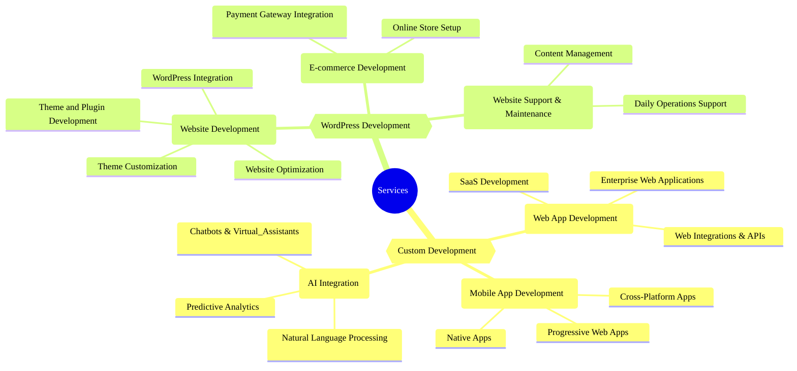

## Services

We offer a variety of services, leveraging our expertise in tailor-made development, WordPress development, and AI integration to align with your business goals and growth.

### 🎨 Custom Development

#### 1. 💻 Web App Development

From concept to launch, we craft scalable, secure, and user-friendly web applications tailored to your business goals and growth.

- **SaaS Development:** Build cloud-first platforms that deliver powerful software solutions to your customers—anytime, anywhere.
- **Enterprise Web Applications:** Streamline and optimize your business processes with robust, custom-built web solutions designed for large organizations.
- **Web Integrations & APIs:** Seamlessly connect your web applications with third-party services and platforms to unlock new features and efficiencies.

#### 2. 📱 Mobile App Development

We design and develop intuitive mobile applications for iOS and Android that engage users and drive business growth.

- **Cross-Platform Apps:** Reach a wider audience with apps that work seamlessly across multiple devices and operating systems.
- **Native Apps:** Deliver high-performance, feature-rich experiences with apps built specifically for iOS or Android.
- **Progressive Web Apps (PWAs):** Combine the best of web and mobile apps to provide fast, reliable, and engaging user experiences.

### 3. 🤖 AI Integration

Leverage the power of artificial intelligence to enhance your applications, automate processes, and gain valuable insights.

- **Chatbots & Virtual Assistants:** Improve customer service and engagement with AI-powered conversational agents.
- **Predictive Analytics:** Make data-driven decisions with AI models that analyze trends and forecast outcomes.
- **Natural Language Processing (NLP):** Enhance user interactions with applications that understand and respond to human language. 

### 🌍 WordPress Development

#### 1. 🌐 Website Development

We create stunning, responsive, and SEO-friendly WordPress websites that effectively represent your brand and engage your audience. 

- **Theme Customization:** Choose from a wide range of themes and customize them to reflect your brand identity and meet your specific needs.
- **Theme and Plugin Development:** Develop themes and plugins from scratch, tailored to your unique requirements and style.
- **Website Optimization:** Improve site speed, performance, and search engine rankings to attract and retain visitors.
- **WordPress Integration:** Seamlessly connect your WordPress site with third-party services and tools to enhance functionality and streamline operations.

#### 2. 🛒 E-commerce Development

- **Online Store Setup:** Launch your online store with WooCommerce, complete with product listings, payment gateways, and shipping options.
- **Payment Gateway Integration:** Securely integrate various payment options to provide a seamless checkout experience for your customers.

#### 3. 🛠️ Website Support & Maintenance

- **Content Management:** We assist with content updates, additions, and optimizations to keep your site fresh and relevant.
- **Daily Operations Support:** Ensure your website runs smoothly with regular updates, backups, and security checks.