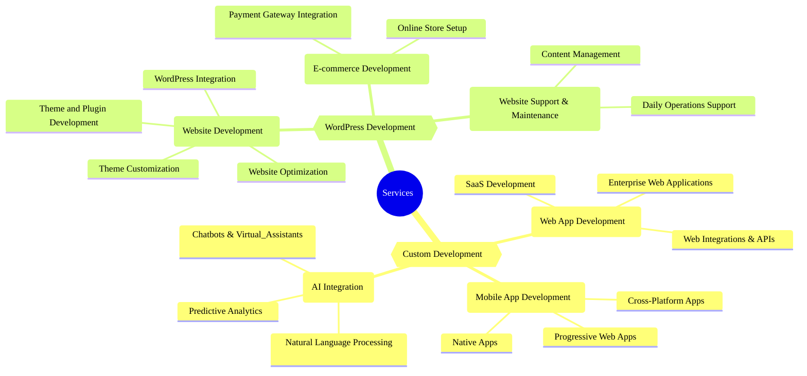

## Services

We don’t just build digital solutions—we engineer your competitive edge. Our team blends creativity, strategy, and technical mastery to deliver results that move your business forward.

### 🎨 Custom Development

#### 1. 💻 Web App Development

Turn your vision into reality. We design and launch scalable, secure, and user-friendly web applications that fuel growth and set you apart.

- **SaaS Development:** Launch cloud-first platforms that deliver powerful, always-on software to your customers—anytime, anywhere.
- **Enterprise Web Applications:** Transform your operations with robust, custom-built solutions that streamline processes and drive efficiency.
- **Web Integrations & APIs:** Supercharge your apps by connecting with third-party services and platforms for seamless workflows and new capabilities.

#### 2. 📱 Mobile App Development

Put your brand in your customers’ hands. We create intuitive mobile apps for iOS and Android that engage, delight, and convert.

- **Cross-Platform Apps:** Reach more users with apps that work flawlessly across devices and operating systems.
- **Native Apps:** Deliver lightning-fast, feature-rich experiences built specifically for iOS or Android.
- **Progressive Web Apps (PWAs):** Combine the best of web and mobile for fast, reliable, and engaging user experiences.

### 3. 🤖 AI Integration

Unlock smarter business. We harness AI to automate, personalize, and deliver insights that give you the edge.

- **Chatbots & Virtual Assistants:** Boost customer service and engagement with AI-powered conversations.
- **Predictive Analytics:** Make smarter decisions with AI models that spot trends and forecast outcomes.
- **Natural Language Processing (NLP):** Create apps that understand and respond to your users—naturally.

### 🌍 WordPress Development

#### 1. 🌐 Website Development

Your website is your digital storefront—make it unforgettable. We build stunning, responsive, and SEO-optimized WordPress sites that attract and convert.

- **Theme Customization:** Stand out with themes tailored to your brand and business goals.
- **Theme and Plugin Development:** Get custom features and functionality built just for you.
- **Website Optimization:** Speed, performance, and search rankings—optimized for results.
- **WordPress Integration:** Connect your site with the tools and services you need to grow.

#### 2. 🛒 E-commerce Development

Sell smarter, not harder. We set up online stores that are secure, scalable, and designed to convert.

- **Online Store Setup:** Launch your WooCommerce store with everything you need to sell online.
- **Payment Gateway Integration:** Offer seamless, secure payment options for your customers.

#### 3. 🛠️ Website Support & Maintenance

Stay ahead, stress-free. We keep your site fresh, secure, and running smoothly—so you can focus on your business.

- **Content Management:** Keep your site up-to-date and relevant with expert content support.
- **Daily Operations Support:** Enjoy peace of mind with regular updates, backups, and security checks.

Upwork Brochure: 

<!---
- Blockchain, NFT & Cryptocurrency
- Al Apps & Integration
- Desktop Application Development
- Ecommerce Development
- Game Design & Development
- Mobile Development
- Other - Software Development
- Product Management & Scrum
- QA Testing
- Scripts & Utilities
- Web & Mobile Design
- Web Development
--->

| Service Code | Service Name                     | Service Category                  | Service Subcategory        | Tag1                  | Tag2                      | Description                                                                                                      |
|--------------|----------------------------------|-----------------------------------|---------------------------|-----------------------|---------------------------|------------------------------------------------------------------------------------------------------------------|
| 1            | SaaS Development                 | Web, Mobile & Software Development| Web Development           | Custom Development    | Web Development           | Cloud-first platforms delivering powerful, always-on software to your customers—anytime, anywhere.                |
| 2            | Enterprise Web Applications      | Web, Mobile & Software Development| Web Development           | Custom Development    | Web Development           | Robust, custom-built web apps that streamline and optimize business processes for large organizations.            |
| 3            | Web Integrations & APIs          | Web, Mobile & Software Development| Web Development           | Custom Development    | Web Development           | Seamlessly connect your apps with third-party services and platforms for enhanced functionality and workflows.     |
| 4            | Cross-Platform Apps              | Web, Mobile & Software Development| Mobile Development        | Custom Development    | Mobile Development        | Apps that work flawlessly across devices and operating systems, maximizing your reach and engagement.              |
| 5            | Native Apps                      | Web, Mobile & Software Development| Mobile Development        | Custom Development    | Mobile Development        | High-performance, feature-rich mobile apps built specifically for iOS or Android.                                 |
| 6            | Progressive Web Apps (PWAs)      | Web, Mobile & Software Development| Mobile Development        | Custom Development    | Mobile Development        | Fast, reliable, and engaging apps that combine the best of web and mobile experiences.                            |
| 7            | Chatbots & Virtual Assistants    | Web, Mobile & Software Development| AI Apps & Integration     | Custom Development    | AI Integration            | AI-powered conversational agents that boost customer service and engagement.                                      |
| 8            | Predictive Analytics             | Web, Mobile & Software Development| AI Apps & Integration     | Custom Development    | AI Integration            | AI models that analyze trends and forecast outcomes, empowering smarter business decisions.                       |
| 9            | Natural Language Processing (NLP)| Web, Mobile & Software Development| AI Apps & Integration     | Custom Development    | AI Integration            | Apps that understand and respond to users naturally, enhancing interaction and automation.                        |
| 10           | Theme Customization              | Web, Mobile & Software Development| Web & Mobile Design       | WordPress Development | Website Development       | Tailored WordPress themes that reflect your brand and business goals.                                             |
| 11           | Theme and Plugin Development     | Web, Mobile & Software Development| Web & Mobile Design       | WordPress Development | Website Development       | Custom themes and plugins built from scratch to deliver unique features and functionality.                        |
| 12           | Website Optimization             | Web, Mobile & Software Development| Web & Mobile Design       | WordPress Development | Website Development       | Speed, performance, and SEO enhancements to attract and retain more visitors.                                     |
| 13           | WordPress Integration            | Web, Mobile & Software Development| Web & Mobile Design       | WordPress Development | Website Development       | Connect your WordPress site with essential tools and services for seamless operations.                            |
| 14           | Online Store Setup               | Web, Mobile & Software Development| Ecommerce Development     | WordPress Development | E-commerce Development    | Launch your WooCommerce store with everything you need to sell online, from products to payments.                 |
| 15           | Payment Gateway Integration      | Web, Mobile & Software Development| Ecommerce Development     | WordPress Development | E-commerce Development    | Secure, seamless payment options integrated for a frictionless checkout experience.                               |
| 16           | Content Management               | Web, Mobile & Software Development| Web & Mobile Design       | WordPress Development | Website Support & Maintenance | Keep your site fresh and relevant with expert content updates and management.                                 |
| 17           | Daily Operations Support         | Web, Mobile & Software Development| Web & Mobile Design       | WordPress Development | Website Support & Maintenance | Regular updates, backups, and security checks to keep your website running smoothly and securely.             |