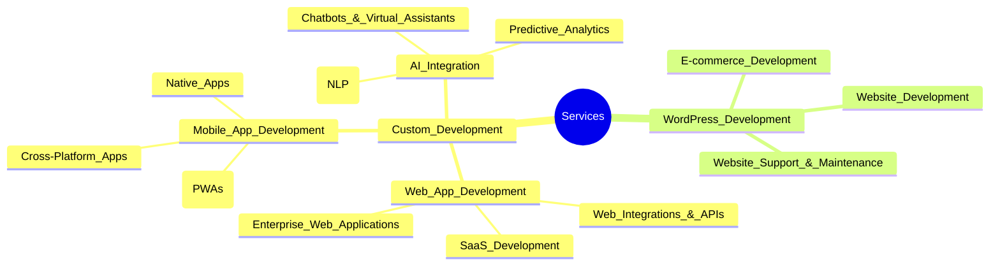

## Services

We offer a variety of services intersected by our expertise in Taylor-made Development, WordPress Development, and AI Integration to align with your business goals and growth.

### 🎨 Custom Development

Taylor-made digital solutions built to your specifications, needs, and growth plans.
- 💻 Web App Development
- 📱 Mobile App Development
- 🤖 AI Integration

#### 1. 💻 Web App Development

From concept to launch, we craft scalable, secure, and user-friendly web applications tailored to your business goals and growth.

- **SaaS Development:** Build cloud-first platforms that deliver powerful software solutions to your customers—anytime, anywhere.
- **Enterprise Web Applications:** Streamline and optimize your business processes with robust, custom-built web solutions designed for large organizations.
- **Web Integrations & APIs:** Seamlessly connect your web applications with third-party services and platforms to unlock new features and efficiencies.

#### 2. 📱 Mobile App Development

We design and develop intuitive mobile applications for iOS and Android that engage users and drive business growth.

-- **Cross-Platform Apps:** Reach a wider audience with apps that work seamlessly across multiple devices and operating systems.
-- **Native Apps:** Deliver high-performance, feature-rich experiences with apps built specifically for iOS or Android.
-- **Progressive Web Apps (PWAs):** Combine the best of web and mobile apps to provide fast, reliable, and engaging user experiences.

### 3. 🤖 AI Integration

Leverage the power of artificial intelligence to enhance your applications, automate processes, and gain valuable insights.

- **Chatbots & Virtual Assistants:** Improve customer service and engagement with AI-powered conversational agents.
- **Predictive Analytics:** Make data-driven decisions with AI models that analyze trends and forecast outcomes.
- **Natural Language Processing (NLP):** Enhance user interactions with applications that understand and respond to human language. 

### 🌍 WordPress Development

- 🌐 Website Development
- 🛒 E-commerce Development
- 🛠️ Website Support & Maintenance

